# HoodDesk

<p align="center">
  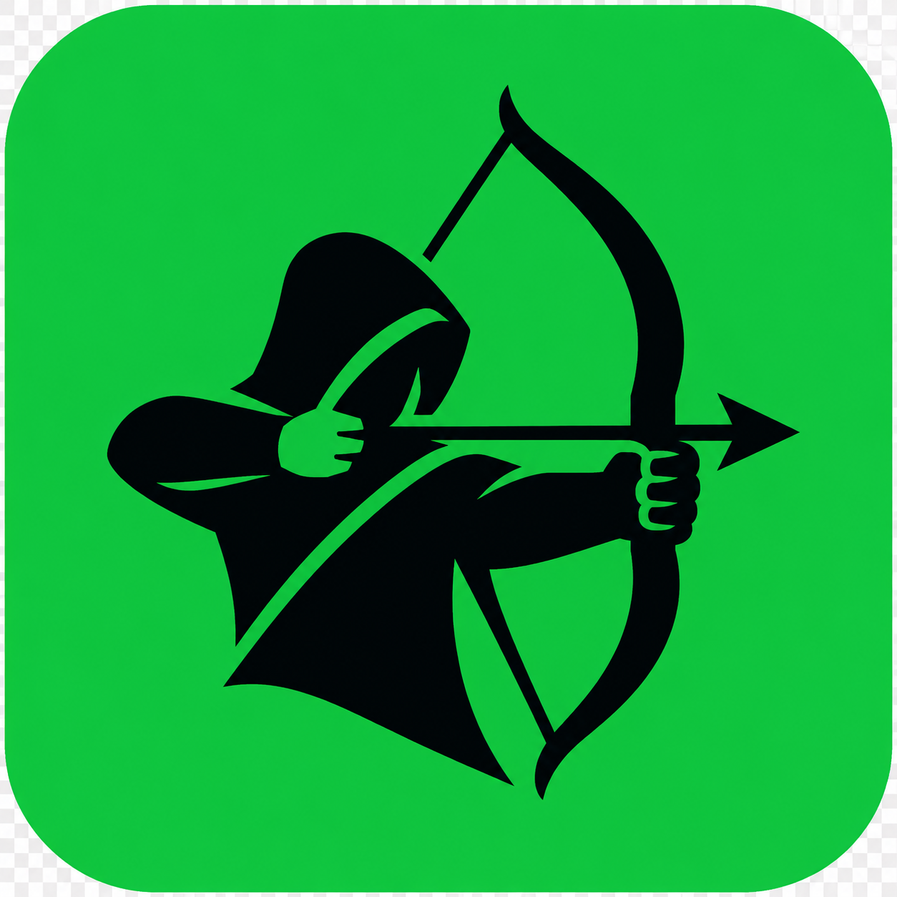
</p>

<p align="center">
  
  
  
</p>

An independent, community-built trading desk for RobinFun launchpad tokens on Robinhood Chain.

HoodDesk is a **public beta** for people looking for features that are not currently available in the RobinFun interface: live token discovery, wallet-initiated swaps, portfolio and activity views, and optional automated orders. It reads live onchain data, with no demo balance or made-up market data.

> [!WARNING]
> HoodDesk can submit real, irreversible transactions on Robinhood Chain mainnet. This beta has not been represented as audited. Use a separate, low-balance wallet; start with a small transaction; and only enable automated execution after you have verified your own deployment.

> [!TIP]
> New to self-hosted apps? Start with **Docker Desktop setup** below. It is the recommended, wallet-only path: no coding, Node.js, private key, or automated orders required.

## A quick look

<p align="center">
  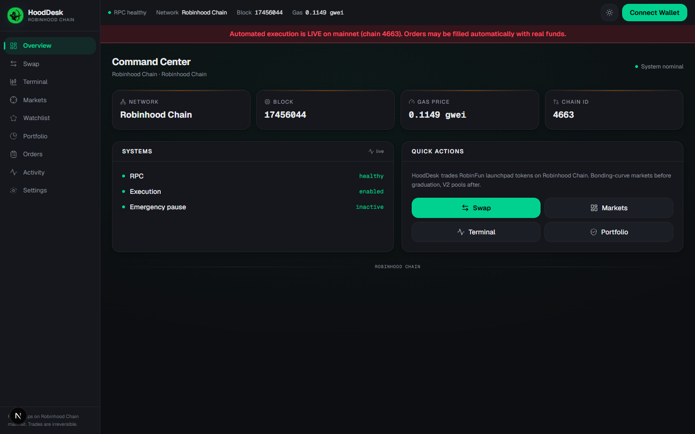
</p>

### Trading tools

| Swap | Limit orders | DCA orders |
|---|---|---|
| 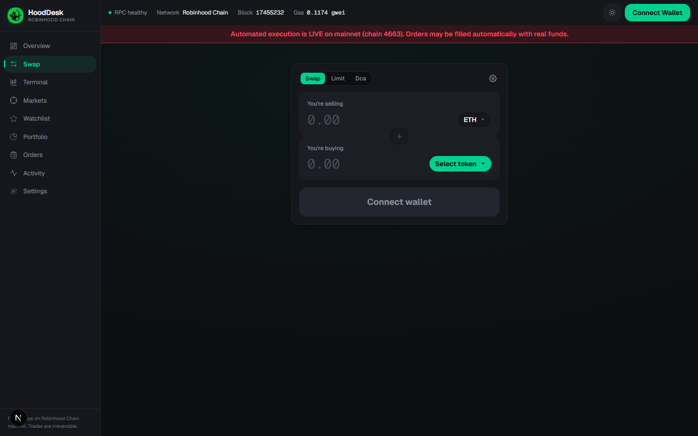 | 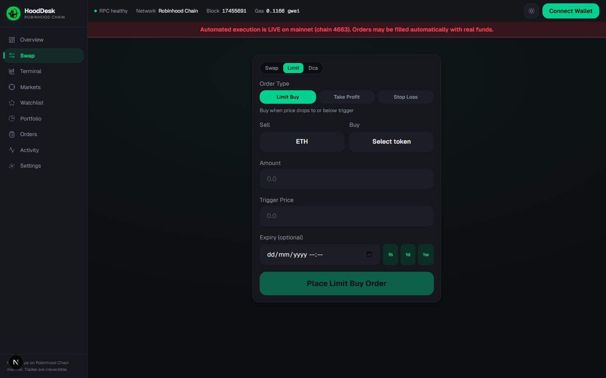 | 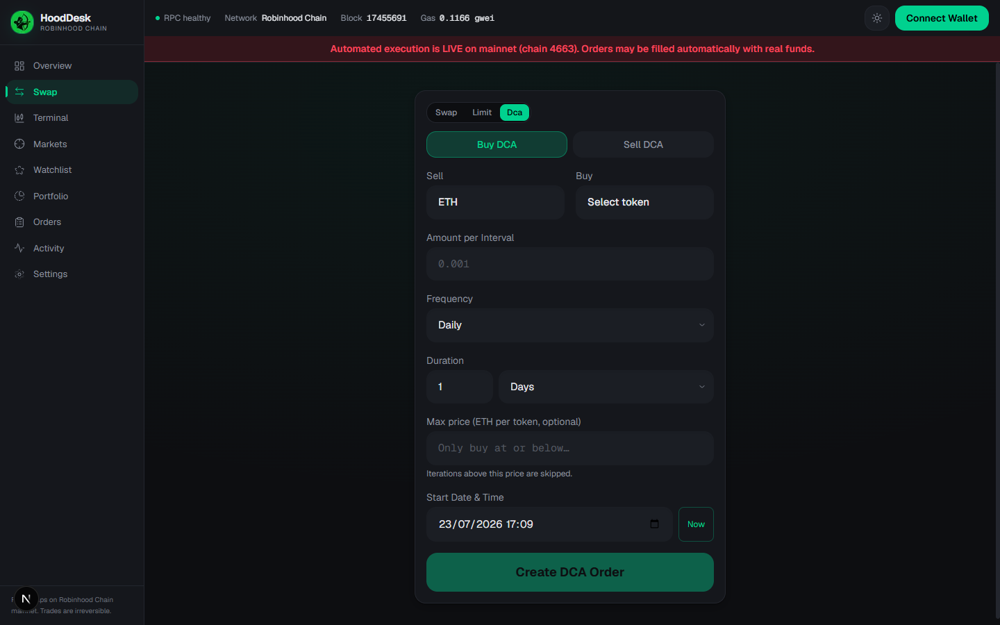 |

### Discover, track, and review

| Markets | Terminal | Watchlist |
|---|---|---|
| 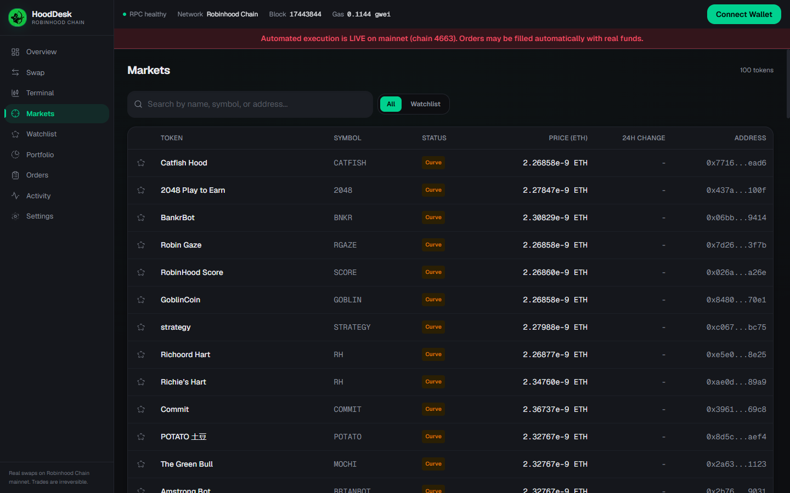 | 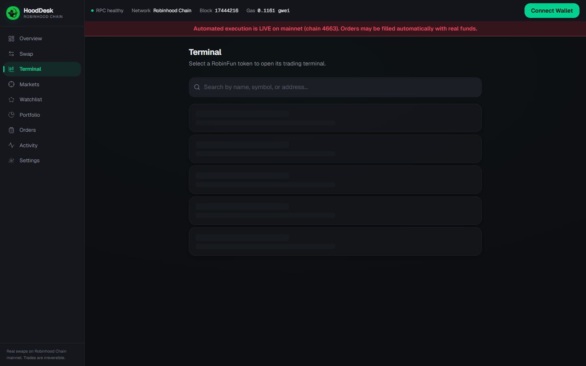 | 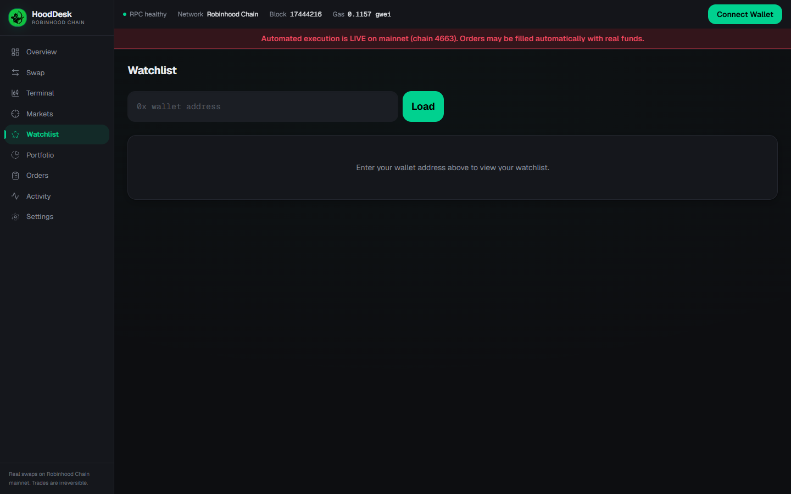 |

| Portfolio | Orders | Activity |
|---|---|---|
| 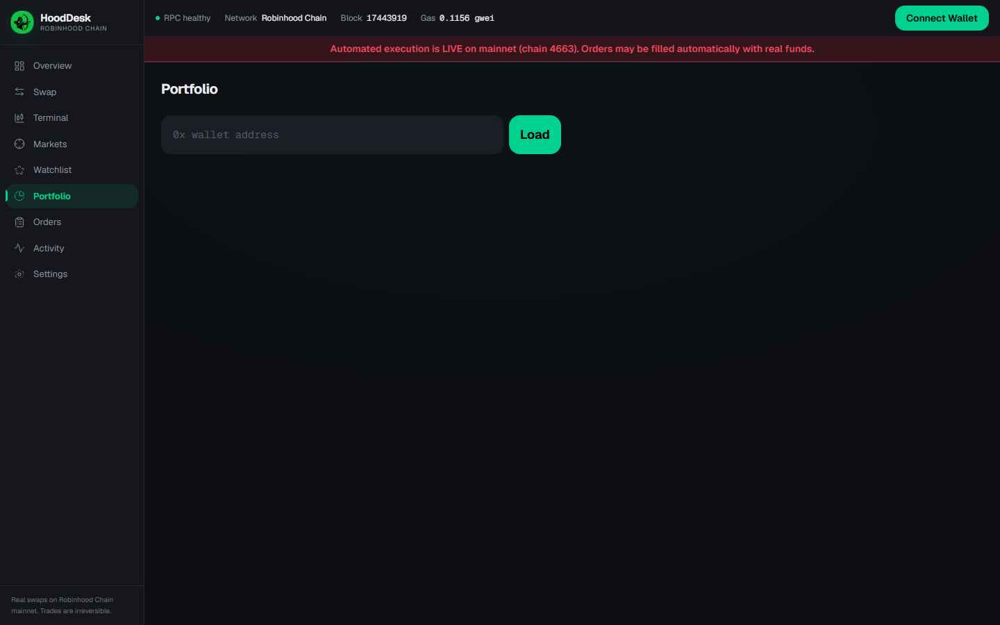 | 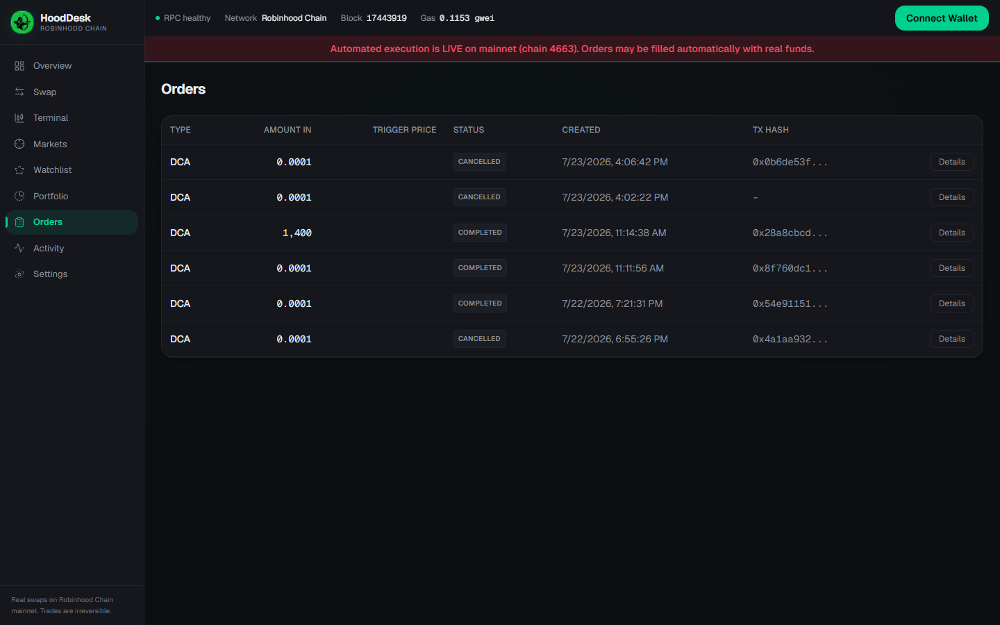 | 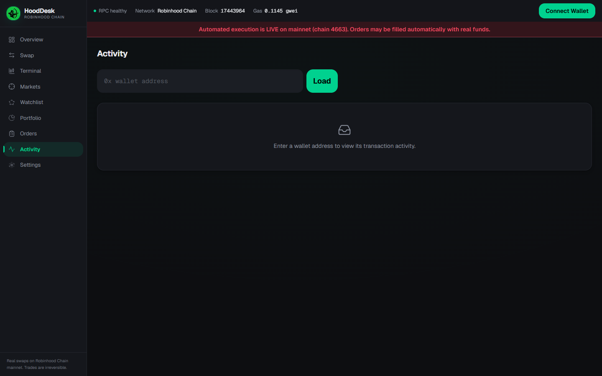 |

Screenshots are captured from a local public-beta build. Market data, wallet state, and available actions will differ on your own deployment.

## Easiest setup — Docker Desktop (recommended)

This keeps HoodDesk on your own computer. You do not need Node.js or programming experience. The default settings keep automated trading off, and HoodDesk never asks for your wallet recovery phrase or browser-wallet private key.

### What you need

- [Docker Desktop](https://www.docker.com/products/docker-desktop/) installed and open. On its download page, choose the version for your computer and accept the default installation options.
- [Git](https://git-scm.com/downloads) installed. Use the default installation options; it lets you download updates later with one command.
- A browser wallet and about 10–15 minutes for the first build.

### Step 1: get HoodDesk

1. Open PowerShell on Windows, or Terminal on macOS or Linux.
2. Copy and run these commands:

   ```bash
   git clone https://github.com/kdkiss/HoodDesk.git
   cd HoodDesk
   ```

   This creates a `HoodDesk` folder and puts you inside it.

### Step 2: create your local settings file

- **Windows:** If you closed PowerShell, open the `HoodDesk` folder in File Explorer, click the address bar, type `powershell`, then press Enter. Copy and run:

  ```powershell
  Copy-Item .env.example .env
  ```

- **macOS or Linux:** If you closed Terminal, type `cd ` (including the space), drag the `HoodDesk` folder into Terminal, press Enter, then run:

  ```bash
  cp .env.example .env
  ```

Keep the copied `.env` file unchanged for your first visit. In particular, do **not** enter an execution private key or turn on automated orders.

### Step 3: start HoodDesk

In that same command window, run:

```bash
docker compose up -d --build
```

The first start downloads and builds the app, so it may take a few minutes. Docker runs HoodDesk in the background, so you can close the command window afterwards. It starts the website and a safe, read-only background worker that cannot sign trades with the default settings.

### Step 4: open HoodDesk and test safely

1. Open [http://localhost:3000](http://localhost:3000) in your browser.
2. Wait for the network indicator to show a healthy connection.
3. Connect a dedicated low-balance wallet and confirm it is on Robinhood Chain.
4. Explore first. If you test a swap, use an amount you are fully prepared to lose and review the wallet confirmation carefully.

To stop HoodDesk, run `docker compose down` from the `HoodDesk` folder. Your local database stays in the `prisma` folder unless you delete it yourself.

### Docker troubleshooting

- If `docker` is “not recognized” or Docker cannot connect, open Docker Desktop, wait until it reports that it is running, then retry.
- If [http://localhost:3000](http://localhost:3000) is unavailable, run `docker compose ps` to check that the containers are running. Another app may already be using port 3000.
- Never share your `.env` file, wallet recovery phrase, private key, or API keys.

### Updating HoodDesk

Stop HoodDesk with `docker compose down`, then run this from the `HoodDesk` folder:

```bash
git pull
docker compose up -d --build
```

Your `.env` file and local database are not replaced by `git pull`.

## Independent project

HoodDesk is an independent project built by one developer. It is **not affiliated with, endorsed by, sponsored by, or supported by** Robinhood Markets, Robinhood Chain, robinfun.live, or their respective teams. Those names are used only to identify the networks and contracts the app can work with; their trademarks belong to their respective owners.

HoodDesk is not a broker, exchange, custodian, or financial adviser. Nothing in this repository or app is investment, legal, or tax advice.

## Public-beta scope

| Area | Beta status | Notes |
|---|---|---|
| Token discovery and live quotes | Available | Reads RobinFun factory and DEX state onchain. Quotes expire after 30 seconds. |
| Wallet-initiated swaps | Available | Uses the connected browser wallet; the app does not receive the wallet’s private key. |
| Portfolio and activity | Available | Data comes from Robinhood Chain and Blockscout. Availability depends on those services. |
| Markets and watchlist | Available | Tracks supported RobinFun markets using live data. |
| Limit, take-profit, stop-loss, and DCA orders | Opt-in / experimental | A separately run worker signs and sends swaps from the execution wallet you configure. Triggered orders are market swaps, not guaranteed fills. |
| Bridge and cross-chain swaps | Unavailable | These incomplete flows are disabled in the public beta. |

Only tokens launched through known RobinFun factories are currently supported. HoodDesk checks whether a token is still on its bonding curve or has graduated, then uses the matching supported route. The supported contract addresses and factory list are defined in [`src/config/contracts.ts`](src/config/contracts.ts).

## How HoodDesk works

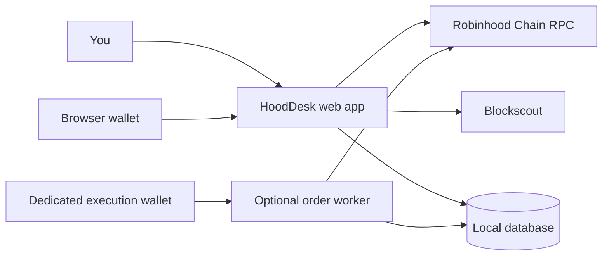

For a normal wallet swap, HoodDesk gets a fresh quote, lets you review it, and asks your browser wallet to approve and sign the transaction. Your browser wallet’s private key never enters HoodDesk.

Automated orders are different: the optional worker watches stored orders and, when a trigger is met, submits a market swap from the separate execution wallet you configured. They are synthetic triggers, not native exchange limit orders.

## Choose your beta path

| Path | Best for | What it does | What you should avoid |
|---|---|---|---|
| **Wallet-only (recommended)** | Most community testers | Browse live data, connect a browser wallet, and make a small swap yourself. | Do not add a private key or start the worker. |
| **Read-only discovery** | Curious testers | Keeps the token list updated in the background. | You can skip it for your first visit. |
| **Automated orders** | Experienced self-hosters | Lets a separate worker sign trigger-based trades from a dedicated wallet. | Do not use a main wallet or large balances. |

## Alternative setup — Node.js

This setup runs HoodDesk on **your own computer**. It does not ask you for your wallet’s seed phrase or private key. You will only approve a transaction inside your browser wallet if you choose to make a swap.

### What you need

- A desktop or laptop with a browser wallet installed.
- About 10–15 minutes and a stable internet connection.
- [Node.js 22.x](https://nodejs.org/en/download/archive/v22) installed. Download the latest 22.x installer for your computer, run it, and accept the default options. HoodDesk does not currently support Node 24 or newer.
- [Git](https://git-scm.com/downloads) installed. Use the default installation options.

### Step 1: get HoodDesk

1. Open PowerShell on Windows, or Terminal on macOS or Linux.
2. Copy and run:

   ```bash
   git clone https://github.com/kdkiss/HoodDesk.git
   cd HoodDesk
   ```

### Step 2: open a command window in that folder

- **Windows:** You are already in the right folder. If you closed PowerShell, open the `HoodDesk` folder in File Explorer, click the address bar, type `powershell`, then press Enter.
- **macOS:** You are already in the right folder. If you closed Terminal, type `cd ` (including the space), then drag the `HoodDesk` folder into Terminal and press Enter.
- **Linux:** You are already in the right folder. If you closed the terminal, open one and change into the `HoodDesk` folder.

You should now see the folder name in the command window. Copy and run each of the following blocks one at a time. Wait for a block to finish before moving on.

### Step 3: install and prepare the app

```bash
npm install
```

```powershell
Copy-Item .env.example .env.local
```

On macOS or Linux, use this command instead of the PowerShell command above:

```bash
cp .env.example .env.local
```

The copied `.env.local` file keeps the safe defaults. **Do not** enter an execution private key or set `EXECUTION_ENABLED=true` / `AUTOMATED_ORDERS_ENABLED=true` for this path.

```bash
npm run db:generate
npx prisma db push
npm run dev
```

The first two commands prepare a small local database. The last command starts HoodDesk. Keep this command window open while you use the app.

### Step 4: open HoodDesk and test safely

1. Open [http://localhost:3000](http://localhost:3000) in your browser.
2. Wait for the network indicator to show a healthy connection.
3. Connect a dedicated low-balance wallet and confirm it is on Robinhood Chain.
4. Explore first. If you decide to test a swap, use an amount you are fully prepared to lose and review the wallet confirmation carefully.

To stop HoodDesk, return to the command window and press `Ctrl` + `C`. Nothing is installed in your wallet, and you can close the browser when you are done.

### If something does not work

- If `npm` is “not recognized” or cannot be found, close the command window after installing Node.js, open it again, and retry.
- If database setup reports `Schema engine error`, check your Node.js version with `node --version`. It must begin with `v22`; Node 24 and newer are not supported yet.
- If the browser cannot open the page, check that `npm run dev` is still running and retry [http://localhost:3000](http://localhost:3000).
- If the app reports a network problem, wait briefly or try again later; public RPC and explorer services can be temporarily unavailable.
- Do not share screenshots that include wallet recovery phrases, private keys, API keys, or `.env.local` contents.

### Updating HoodDesk

Stop the development server with `Ctrl` + `C`, then run this from the `HoodDesk` folder:

```bash
git pull
npm install
npm run db:generate
npx prisma db push
npm run dev
```

Your `.env.local` file and local database are not replaced by `git pull`.

## Before you begin

- Node.js 22.x and npm (the project supports Node `>=22 <24`).
- A browser wallet that supports injected EVM wallets. A WalletConnect project ID is optional.
- The built-in Robinhood Chain RPC endpoint. HoodDesk currently uses the endpoints defined in [`src/config/chains.ts`](src/config/chains.ts); the RPC URL fields in `.env.example` are not runtime overrides yet.
- A Blockscout API key is optional for basic use and recommended for reliable explorer-backed portfolio, activity, and token data.
- For automated orders only: a **dedicated execution wallet** with a small native-token balance for gas. Never use a wallet that holds funds you cannot afford to lose.

RobinFun contracts in this project are configured for mainnet. Testnet configuration alone does not make RobinFun trading available on testnet.

## Developer setup: read-only and wallet-swap beta

1. Clone the repository and install dependencies.

   ```bash
   git clone https://github.com/kdkiss/HoodDesk.git
   cd HoodDesk
   npm install
   ```

2. Create your local configuration. Keep `EXECUTION_ENABLED=false`; that is the safe default.

   ```bash
   cp .env.example .env.local
   ```

   On Windows PowerShell, use:

   ```powershell
   Copy-Item .env.example .env.local
   ```

3. In `.env.local`, add `BLOCKSCOUT_API_KEY` if you have one. To use WalletConnect, also add `NEXT_PUBLIC_WALLETCONNECT_PROJECT_ID`.

4. Generate the database client, create or update your local database, and start the app.

   ```bash
   npm run db:generate
   npx prisma db push
   npm run dev
   ```

5. Open [http://localhost:3000](http://localhost:3000). Confirm that the network status is healthy, connect a low-balance wallet, and verify the chain before attempting a small swap.

The web app can be used without running the worker. Run the worker only when you want background token discovery or are intentionally testing automated orders:

```bash
npm run worker:dev
```

With execution disabled, the worker performs read-only token discovery and will not sign trades.

## Enabling automated orders

Automated orders are an advanced beta feature. The worker is a single-process service and must have exclusive control of its execution wallet’s transaction nonce.

Before setting `EXECUTION_ENABLED=true` and `AUTOMATED_ORDERS_ENABLED=true`, make sure that:

1. Your web app and worker point to the same database.
2. `EXECUTION_PRIVATE_KEY` belongs to a new, dedicated wallet with only a small amount of funds for this test.
3. You have checked the configured factory/router allowlists and slippage limits in `.env.local`.
4. The worker can reach the intended mainnet RPC and the health endpoint reports the expected chain.
5. `EMERGENCY_PAUSE=false` only when you deliberately want the worker to execute orders.

Then restart the worker after changing the environment:

```dotenv
EXECUTION_ENABLED=true
AUTOMATED_ORDERS_ENABLED=true
EXECUTION_PRIVATE_KEY=0x...
EMERGENCY_PAUSE=false
```

To stop automated execution, set `EMERGENCY_PAUSE=true` (or either execution flag to `false`) and restart the worker. The worker environment is the only emergency-pause control; restarting the process with the safe setting is required.

## Safety and operating limits

- Swaps use fresh onchain quotes, minimum-output slippage protection, and transaction deadlines, but a quote is not a promise of execution price.
- Automated orders are synthetic triggers. Once triggered, the worker submits a market swap; it can fail, execute late, or fill at a substantially different price.
- The worker checks configured allowlists before it calls contracts. Review all addresses yourself before deploying.
- The execution private key is intended to be read only by the worker process. Do not put it in client-side variables, commit it, share it, or reuse it.
- `EXECUTION_ENABLED` defaults to `false`. Read-only discovery can run while execution is disabled or emergency-paused.
- `AUTOMATED_ORDERS_ENABLED` is a separate, required opt-in. A public deployment cannot create automated orders unless you explicitly enable it.
- The built-in rate limiter is in memory and is not suitable for horizontally scaled or untrusted public deployments. Do not expose an instance to the internet without adding appropriate authentication, rate limiting, monitoring, and operational controls.
- If onchain, RPC, or Blockscout data is missing, treat it as unavailable. Do not guess or retry a transaction blindly.

## Configuration reference

The complete template is [`.env.example`](.env.example). Common settings:

| Variable | Purpose |
|---|---|
| `NEXT_PUBLIC_CHAIN_ID` | Network selection; defaults to Robinhood Chain mainnet (`4663`). |
| `BLOCKSCOUT_API_KEY` | Recommended API key for Blockscout-backed data. |
| `NEXT_PUBLIC_WALLETCONNECT_PROJECT_ID` | Optional WalletConnect integration. |
| `DATABASE_URL` | Prisma database connection; SQLite is the development default. |
| `TOKEN_DISCOVERY_ENABLED` | Enables read-only background token discovery. |
| `EXECUTION_ENABLED` | Must be `true` before the worker can sign automated orders. |
| `AUTOMATED_ORDERS_ENABLED` | Must also be `true` before the app accepts automated orders. |
| `EXECUTION_PRIVATE_KEY` | Private key for the dedicated execution wallet; keep secret. |
| `EMERGENCY_PAUSE` | Stops the worker from signing automated trades when set to `true`. |
| `DEFAULT_SLIPPAGE_BPS`, `MAX_SLIPPAGE_BPS` | Fallback quote slippage and the maximum allowed automated-order slippage. |

`NEXT_PUBLIC_RPC_URL`, `ROBINHOOD_CHAIN_RPC_URL`, and the contract-address fields in `.env.example` are reserved for future configuration support. Changing them does not currently change HoodDesk’s routes or RPC endpoint.

## Docker deployment notes

The Docker Desktop walkthrough above is the recommended way to run HoodDesk locally. For a hosted deployment, use a public HTTPS URL, place the app behind a TLS-terminating reverse proxy, keep the database volume and configuration private, and do not put a funded execution key in a broadly shared `.env` file.

## Checks before reporting a beta issue

Please run the relevant checks first when possible:

```bash
npm run lint
npm run typecheck
npm run test
npm run build
```

When opening an [issue](https://github.com/kdkiss/HoodDesk/issues), please include:

- HoodDesk version or commit
- Browser and wallet used
- Network
- Exact, non-sensitive steps to reproduce the issue
- Expected and actual behavior
- Transaction hash, if one exists
- Relevant non-sensitive logs or screenshots

Never post private keys, seed phrases, API keys, wallet backup files, or `.env.local` contents.

For a potential security issue, follow the private reporting instructions in [Security Policy](docs/SECURITY.md); do not publish exploit details or secrets in a public issue.

## Contributing

Community feedback, bug reports, tests, and documentation improvements are welcome. Before proposing a change that touches signing, order execution, contract addresses, authentication, or user funds, open an issue first so the safety impact can be discussed.

## Known limitations

- HoodDesk has no represented third-party security audit.
- Automated orders are synthetic triggers, so they do not guarantee a fill, transaction inclusion, or execution price.
- Data and transactions depend on external RPC and Blockscout services being available.
- The automated-order worker is designed for one process and one execution wallet; it is not horizontally scalable.
- The built-in rate limiter is in memory and unsuitable for untrusted public deployments without additional infrastructure.
- Support is limited to known RobinFun factories and configured routes. Token contracts can behave unexpectedly and may not act like a standard ERC-20.
- Bridge and cross-chain flows are intentionally unavailable in this release.

## Disclaimer

This software is experimental and provided as-is. Blockchain transactions are irreversible, token contracts may behave unexpectedly, and you may lose some or all funds used with the app. You are responsible for verifying every transaction, contract address, allowance, configuration value, and risk before use.

## License

HoodDesk is available under the [MIT License](LICENSE).
